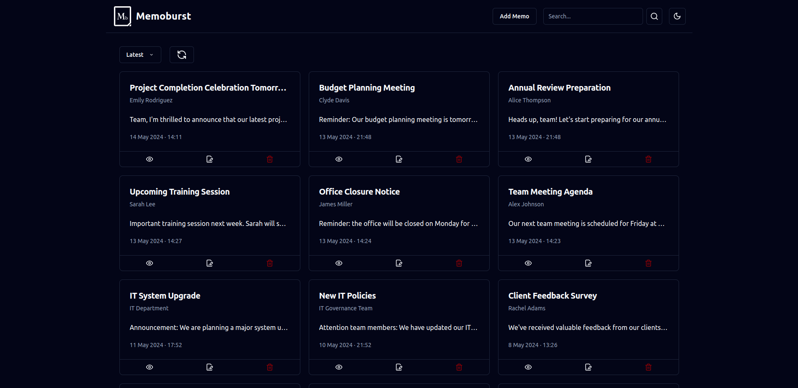
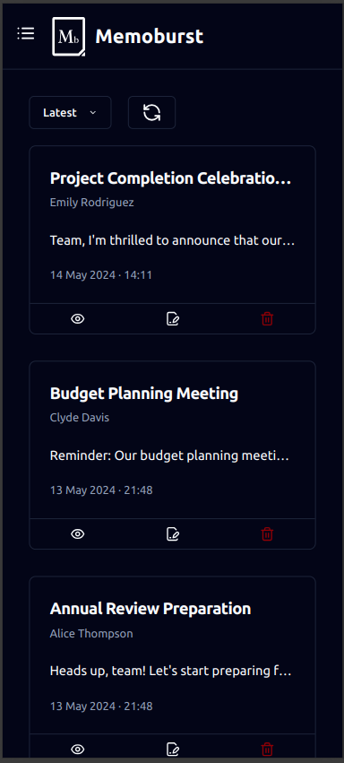

# Project Name

MemoBurst is a powerful internal communication tool designed to streamline the sharing of notes, announcements, and reminders within a company or organization. Built using Next.js 14, MemoBurst leverages the latest features of this robust React framework to ensure high performance and scalability. The application integrates with MongoDB Atlas, providing a reliable and secure database solution for storing and managing all company communications. With MemoBurst, organizations can enhance their internal collaboration and ensure that important information is easily accessible and well-organized.

## Table of Contents

- Features
- Installation
- Frameworks, Libraries and Dependencies
- Demo

## Features

- Note Sharing: Easily create and share detailed notes with team members.
- Responsive Design: Fully responsive interface for optimal use on desktops, tablets, and mobile devices.
- Search Functionality: Powerful search tool to quickly find specific notes or announcements.
- User-friendly Interface: Intuitive and easy-to-navigate design for a seamless user experience.
- Real-time Updates: Instant updates and notifications for new notes, announcements, and reminders.
- Sorting Options: Sort notes and announcements by latest, oldest, ascending, and descending order for easy organization and access.

## Installation

1. Clone this repository.
2. Install dependencies using `npm install`.
3. Run the development server with `npm run dev`.

## Frameworks, Libraries and Dependencies

- Next 14
- Tailwind CSS
- Shadcn
- Zod
- Typescript
- React Hook Form
- Mongodb
- Dotenv

## Demo

1. Main Page (Desktop Version)

   

2. Main Page (Mobile Version)

   
